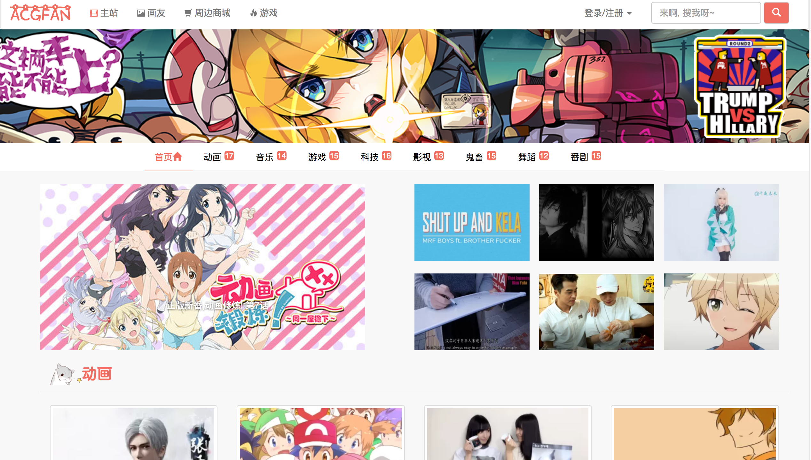
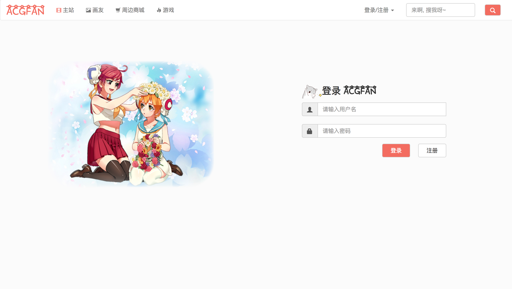
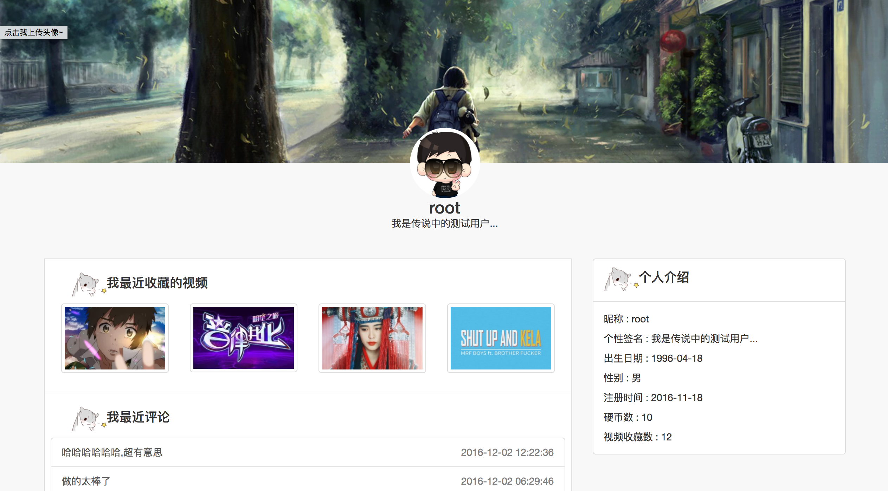
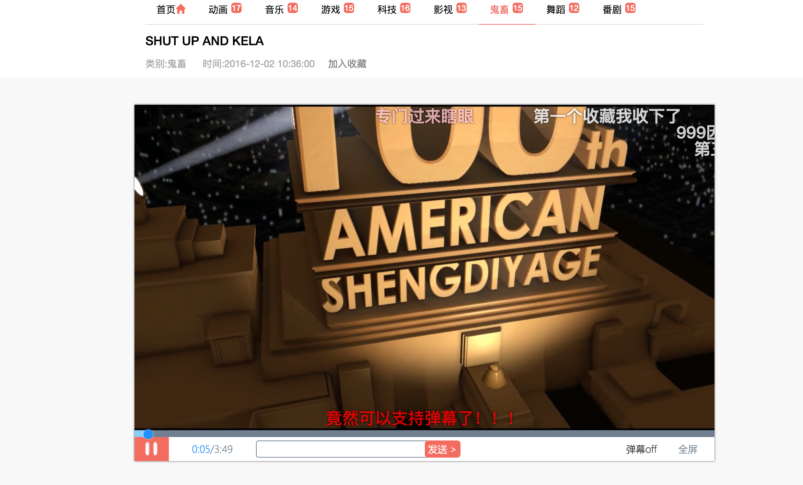
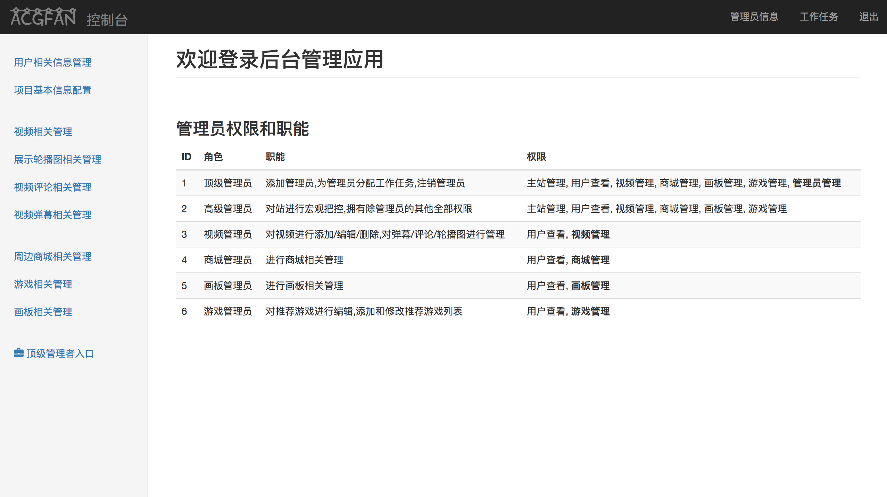
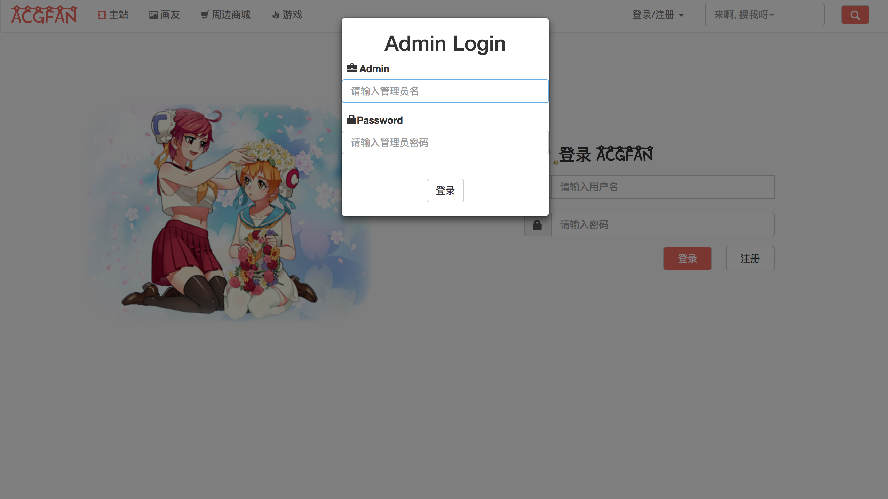
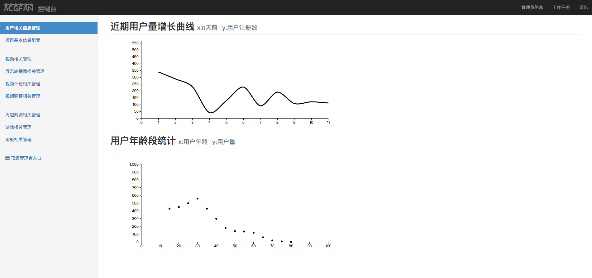
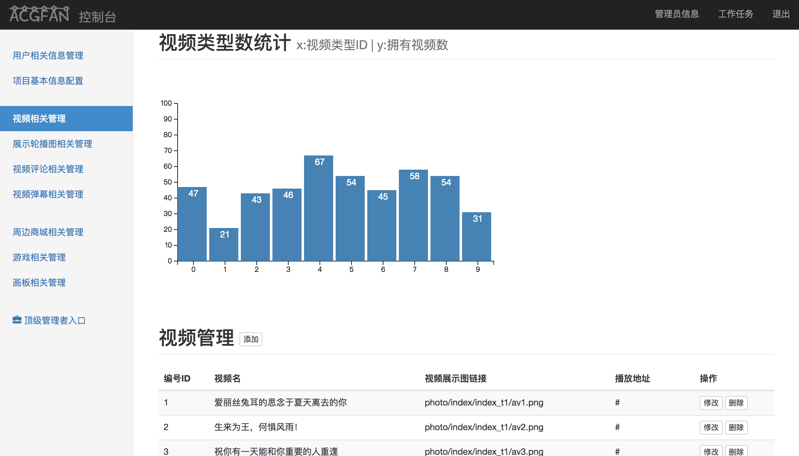

acgfan
======================

项目介绍
======================

一个动漫主题的视频网站,支持视频播放、评论、弹幕、收藏等操作;
并提供画板、商城、游戏等其他附属板块

使用技术
======================

**前端**

+ UI框架: Bootstrap3

+ 前端MV*框架: Angular1

+ 数据可视化处理库: D3.js

**后端**

+ Web MVC框架: Struts2

+ ORM框架: Hibernate for JPA

+ IOC与AOP框架: Spring

+ 安全框架: Shiro

起步
======================

1. 下载并安装MySQL,创建数据库名字为acg,导入acgfan/WebContent/WEB-INF/public/acg.sql

2. 下载并安装Tomcat服务器

3. 使用Java主流IDE,导入项目后配置Tomcat服务器后即可运行

4. 普通用户的账号名为root,密码为root;管理员用户的账号名为admin,密码为root

功能介绍
======================

该系统分为视频主站和后台管理两大部分

### 视频主站

+ 未登录的用户可以在视频主站查看视频、发送弹幕,浏览画板、游戏、商城等模块
+ 登录后的用户在未登录用户可以使用的功能外还可以对视频进行评论、收藏,查看个人中心等功能
+ 尚未注册的用户可以通过答题获取注册权限,当系统提供的五道选择题全部答对后即可跳转到注册页面进行注册

### 后台管理

+ 在用户登录界面中,在用户名表单中填写"$admin"即可打开管理员后台登录入口

+ 每个管理员对应一个角色,不同角色相应的权限不同,可以在后台管理首页查看到对应角色的职能与权限

+ 顶级管理员允许对管理员进行管理,并可以向管理员发布工作任务;低级管理员需要根据任务执行自己的工作职能

功能截图
======================

### 前台视频主站

+ 网站首页

+ 登录页面

+ 个人中心

+ 视频播放

+ 画板页面

+ 游戏页面

### 后台管理程序

+ 后台管理首页

+ 管理员登录

+ 用户信息

+ 视频相关操作

